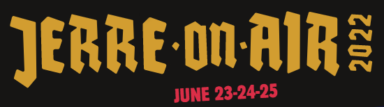
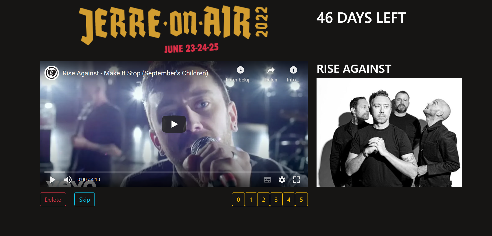

# Jerre on Air

This website will help you get hyped up for the upcomming punkrock festival Jera on Air in the Netherlands.\
You can listen and rate to songs of the artists that are coming to the festival.

The application is tailored to the festival [Jera on Air](https://www.jeraonair.nl/nl/).\
It can also be used as a baseline for another festival you want to go to.



## Setup
Go through the [jupyter notebook](jerre_on_air.ipynb) to setup the backend and its database.

Setup the frontend with
```
npm install
```
[A launch script is included](./launch.bat) with an [icon](launch_icon.ico) to the make the shortcut nicer.
Or you can do it manually with
```
python ./backend/manage.py runserver
npm start --prefix ./player
```

## Usage
The website runs locally on [http://localhost:3000/](http://localhost:3000/).\
The backend runs on [http://localhost:8000/](http://localhost:8000/).\
Django provides a nice interface to interact with the data on [http://localhost:8000/api/](http://localhost:8000/api/).


